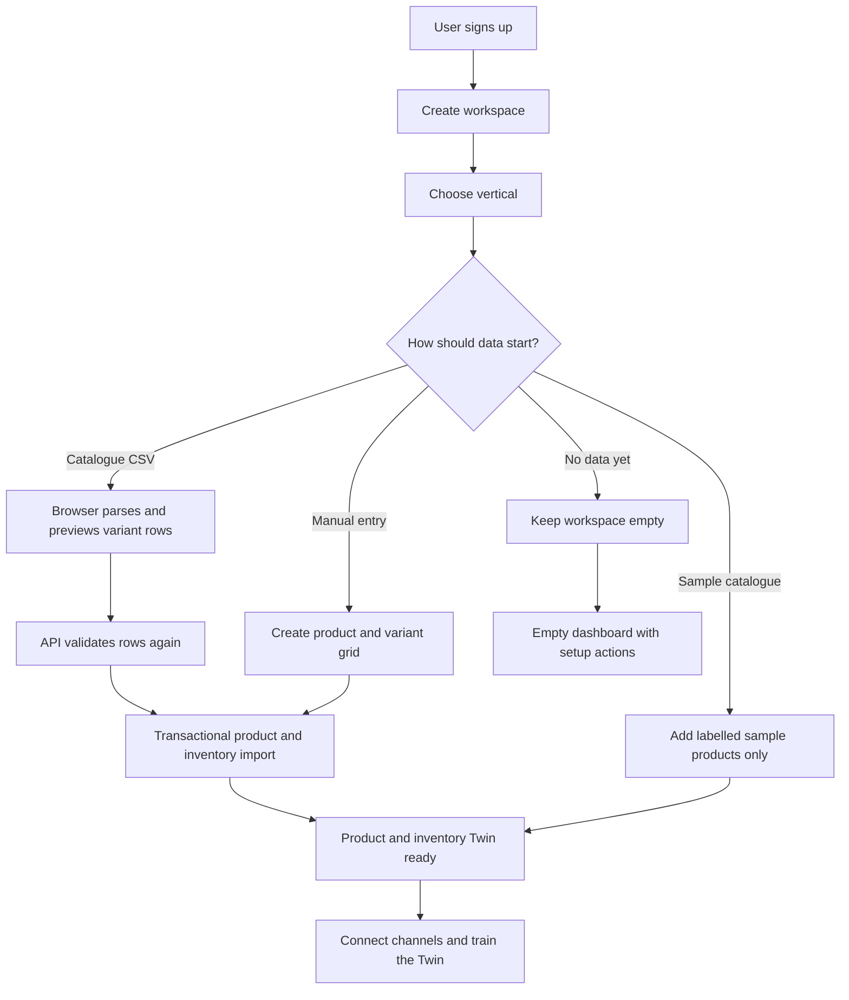
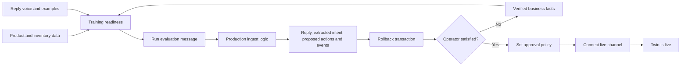
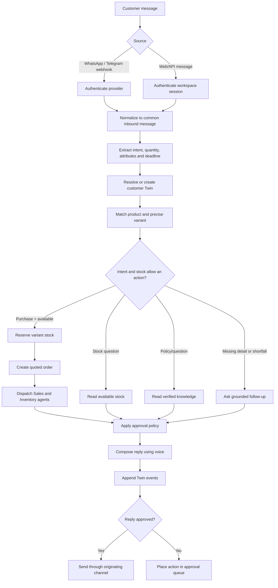
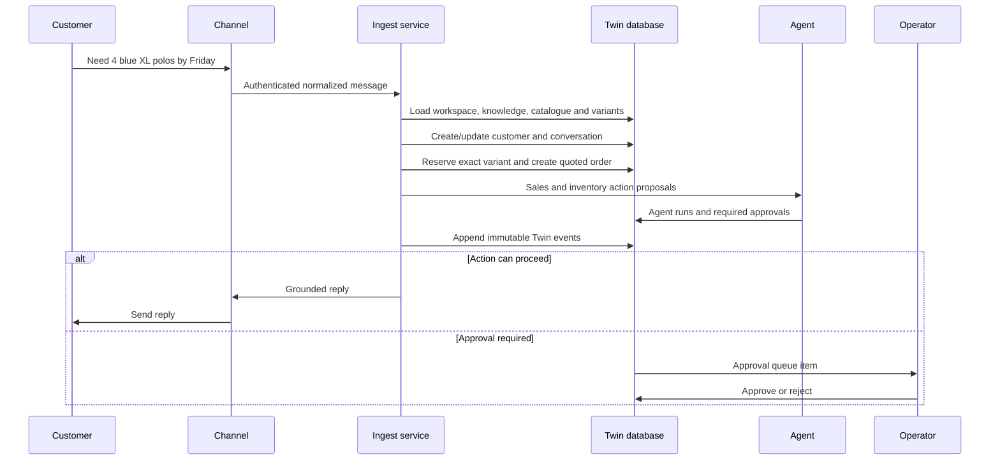
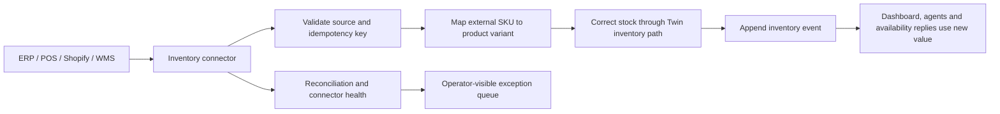

# Twin Workflow

This document shows operational flows separately from the system architecture.

## 1. Workspace and data onboarding

No path creates fictional conversations, orders, customers, invoices, approvals
or KPIs.

## 2. Twin training and activation

Evaluation validates behavior without changing live stock, customer records,
orders, approvals or dashboard metrics.

## 3. Live message to grounded reply

## 4. State mutation and audit trail

## 5. Current-stock synchronization target

CSV import is the initial-stock path; this connector flow is what keeps stock
current after it. Both are implemented. The source pushes absolute counts to
`POST /v1/inventory/:id/sync` with an idempotency key and its own cursor; a row
that cannot be mapped or applied lands in the exception queue on
`/dashboard/inventory/connectors` rather than being dropped.
